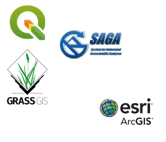

```{r setup, include = FALSE}
options(htmltools.dir.version = FALSE)
library(RefManageR)
BibOptions(check.entries = FALSE, 
           bib.style = "authoryear", 
           cite.style = 'alphabetic', 
           style = "markdown",
           first.inits = FALSE,
           hyperlink = FALSE, 
           dashed = FALSE)
my_bib = ReadBib("references.bib", check = FALSE)
```

layout: true
background-image: url(img/r_geocomp_background.png)
background-size: cover

---
# Who we are

<center>
<figure>

</figure>
</center>

**Welcome** to our tutorial!

We are the authors of [Geocomputation with R](https://geocompr.robinlovelace.net/)

Find [here](https://geocompr.robinlovelace.net/) the online home of our book.

- [Robin Lovelace](https://www.robinlovelace.net/) - Geographer and Environmental Scientist focussing on sustainable transport planning; creator of **stplanr**.
--

- [Jakub Nowosad](https://nowosad.github.io/) - Computational geographer with a focus on the analysis of large datasets to understand environmental processes; creator of the **sabre** package.
--

- [Jannes Muenchow](http://www.geographie.uni-jena.de/en/Muenchow.html) - GIScientist with a special focus on ecology, landsliding and geomarketing; creator of the **RQGIS(3)** package.

---

# Where are we from

<center>
```{r, echo = FALSE}
library(leaflet)
popup = c("Robin", "Jakub", "Jannes")
leaflet() %>%
  addProviderTiles("NASAGIBS.ViirsEarthAtNight2012") %>%
  addMarkers(lng = c(-3, 23, 11),
             lat = c(52, 53, 49), 
             popup = popup)
```

---

# About the book

Take a look here: https://geocompr.robinlovelace.net/

Source code: https://github.com/robinlovelace/geocompr

--

Win a copy of the book for:

1. Best map (upload a map to https://github.com/Robinlovelace/geocompr/issues/371 )

2. Best questions (ask us!)

3. We'll decide at the end

---
# Summer school 2019 in Jena

If you want more than a 1.5h tutorial, apply for our summer school!

https://jupiter.geogr.uni-jena.de/summerschool/about/


```{r, echo=FALSE, out.width="60%", fig.align="center"}
knitr::include_graphics("img/spat_logos.png")
```

--

**Summer school**: 25 August to 1 September 2019
<br>
Application **deadline**: 15 May 2019
<br>
**Fees**: 100€

Funded by the German Academic Exchange Service ([**DAAD**](https://www.daad.de/en/)), therefore accepted **international (PhD or Msc) students** will receive upon completion of the summer school:

- a flat-rate allowance of **250** Euros
- a country-dependent **travel stipend** amounting to at least 200 Euros 

???
Applicants from Germany and senior researchers (PostDocs, Professors) are welcome to apply but only a limited number can be admitted and no funding can be granted.

**This means, that each accepted international participant (student or PhD student) will receive at least 450 Euros upon succeful completion of the summer school!!!**

---

# Workshop in Leeds, UK

- 2 day workshop in the Leeds Institute for Data Analytics: [lida.leeds.ac.uk/event](https://lida.leeds.ac.uk/event/geocomputation-data-analysis-r/)

- Date: 25th to 26th April - 2 weeks tomorrow!

--

- More events? See the #geocompr hashtag on Twitter!

```{r, echo=FALSE}
knitr::include_graphics("https://user-images.githubusercontent.com/1825120/55670985-962c7700-5882-11e9-8bef-188854547011.png")
```

---

# Contents of the tutorial

```{r, eval=FALSE, echo=FALSE}
library(sf)
library(spData)
world_laea = st_transform(world, 
                          crs = "+proj=laea +x_0=0 +y_0=0 +lon_0=-77 +lat_0=39")
gr = st_graticule(ndiscr = 1000) %>%
  st_transform("+proj=laea +y_0=0 +lon_0=-77 +lat_0=39 +ellps=WGS84 +no_defs")
png(filename = "pres/img/globe.png")
plot(gr$geometry, col = "lightgray", lwd = 3)
plot(world_laea$geom, bg = "white", col = "lightgray", add = TRUE)
dev.off()
```

<figure>

</figure>


1. Spatial vector data
--

1. Spatial raster data
--

1. Mapping
--

1. Bridges to GIS

--

If you want to know more on "Bridges to GIS":

- [RQGIS R Journal paper](https://journal.r-project.org/archive/2017/RJ-2017-067/RJ-2017-067.pdf) `r Citep(my_bib, "muenchow_rqgis_2017", .opts = list(cite.style = "authoryear"))`
- [Bridges to GIS chapter](https://geocompr.robinlovelace.net/gis.html) `r Citep(my_bib, "lovelace_geocomputation_2019", .opts = list(cite.style = "authoryear"))`


---

class: inverse, center, middle

# Some definitions
---

# What is a GIS?

<figure>

</figure>

- A **G**eographic **I**nformation **S**ystem is a system for the analysis, manipulation and visualization of geographical data `r Citep(my_bib, "longley_geographic_2015a", .opts = list(cite.style = "authoryear"))`.

--

- Six components of a GIS: software, data, procedures, hardware, people, network
--

- Typical GIS software packages: QGIS, SAGA-GIS, GRASS-GIS, ArcMap (commercial)

???
Remember R has never been intended to be a GIS though it is great that we can use it as one. Certain spatial operations are not possible. But R has been designed from the beginning as an interface to other languages. And later on, we will see how we can build bridges from R to GIS software.
---

# What is geocomputation?
- Geocomputation
- GIScience
- Geographic data science
--

### Graphical User Interface (GUI) GIS vs Geocomputation with R

```{r gdsl, echo=FALSE, message=FALSE}
d = readr::read_csv("https://github.com/Robinlovelace/geocompr/raw/master/extdata/gis-vs-gds-table.csv")
knitr::kable(x = d, format = "html")
```

<br>
<br>
--
Further reading:
[https://geocompr.robinlovelace.net/intro.html#what-is-geocomputation](https://geocompr.robinlovelace.net/intro.html#what-is-geocomputation)

???
"Geographic information systems are useful tools, helping everyone from scientists to citizens to solve geographic problems. But like many other kinds of tools, such as computers themselves, their use raises questions that are sometimes frustrating, and sometimes profound. For example, how does a GIS user know that the results obtained are accurate? What principles might help a GIS user to design better maps? How can locationbased services be used to help users to navigate and understand human and natural environments? Some of these are questions of GIS design, and others are aboutGIS data and methods. Taken together, we can think of them as questions that arise from the use of GIS - that are stimulated by exposure to GIS or to its products. Many of them are addressed in detail at many points in this book,
and the book's title emphasizes the importance of both systems and science. The term geographic information science was coined in a paper by Michael Goodchild published in 1992. In it, the author argued that these questions and others like them were important, and that their systematic study constituted a science in its own right. Information science studies the fundamental issues arising from the creation, handling, storage, and use of information - similarly, GIScience should study the fundamental issues arising from geographic information, as a well-defined class of information in general. Other terms have much the same meaning: geomatics and geoinformatics, spatial information science, geoinformation engineering. All suggest a scientific approach to the fundamental issues raised by the use of GIS and related technologies, though they all have different roots and emphasize different ways of thinking about problems (specifically geographic or more generally spatial,
emphasizing engineering or science, etc.) (Longley et al., 2005)."

"There are many close synonyms for geographic information science (GIScience), one of which is geocomputation - a term first coined by the geographer Stan Openshaw to describe the scientific application of computationally-intensive techniques to problems with a spatial dimension" (Longley et al., 2005).

---
# Geographic data (models)

- Geographic data consists of **xy-coordinates** and corresponding **attributes** (this might include a time stamp, otherwise the data is static).
--

- Usually we neglect the curvature of the Earth when visualizing geographic data.
--

- Geographic data only represents a simplified representation of the world. So we decide what we display for which purpose.
--

- Geographic data can quickly become big.
--

- Two data models for representing digitally geographic data: **the vector** `r Citep(my_bib, "pebesma_simple_2018", .opts = list(cite.style = "authoryear"))` and **the raster** `r Citep(my_bib, "hijmans_raster_2019", .opts = list(cite.style = "authoryear"))` data model.

???
Do not confuse the spatial vector data model with the vectors in R. The two are completely different things and in fact unrelated. Though we will see that we use vectors in R to represent the spatial vector data model.

---
class: small
# References
```{r, 'refs', results="asis", echo=FALSE}
PrintBibliography(my_bib)
```